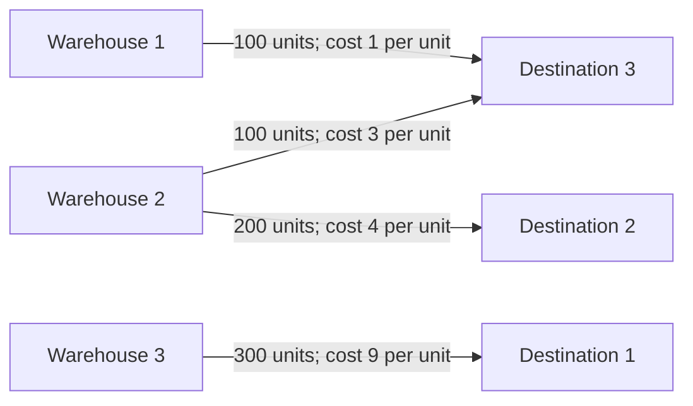

# Case Study: Minimum-Cost Delivery Planning

An illustrative logistics scenario using the original coursework data. Three warehouses supply three destinations, and the task is to allocate shipments at minimum total cost while meeting every supply and demand requirement.

The computed allocation reported from the original script has a total cost of **3900 monetary units**, compared with **4500** for the northwest corner initialization: a reduction of **600 units (13.3%)**. A mathematical lower-bound certificate below establishes optimality for this instance.

## Data and assumptions

| Warehouse | Cost to destination 1 | Cost to destination 2 | Cost to destination 3 | Supply |
| --- | ---: | ---: | ---: | ---: |
| 1 | 8 | 4 | 1 | 100 |
| 2 | 8 | 4 | 3 | 300 |
| 3 | 9 | 7 | 5 | 300 |
| **Demand** | **300** | **200** | **200** | **700** |

Costs are per unit shipped in arbitrary monetary units. The data is illustrative coursework data, not an observed commercial operation.

The model assumes a single product, fixed supply and demand, constant costs per unit, and unrestricted capacity on each route. All supply must be shipped and all demand met. There are no fixed dispatch costs, delivery deadlines, or vehicle-routing decisions. Shipment quantities are modeled as nonnegative continuous variables; the reported solution happens to be integral.

## Mathematical formulation

Let $x_{ij}$ denote the quantity shipped from warehouse $i$ to destination $j$, with unit cost $c_{ij}$, supply $a_i$, and demand $b_j$.

$$
\min_x \sum_{i=1}^{3}\sum_{j=1}^{3} c_{ij}x_{ij}
$$

subject to:

$$
\sum_{j=1}^{3}x_{ij}=a_i \quad (i=1,2,3),
$$

$$
\sum_{i=1}^{3}x_{ij}=b_j \quad (j=1,2,3), \qquad x_{ij}\geq 0.
$$

Total supply equals total demand at 700 units, so this instance is balanced and requires no dummy warehouse or destination.

## Method

The [implementation](../matrix_transport_problem/core.py) uses two stages:

1. The [northwest corner rule](../matrix_transport_problem/north_west_corner_rule.py) constructs a feasible allocation by exhausting supply or demand one cell at a time, without considering costs.
2. The [optimization stage](../matrix_transport_problem/search_optimal_plan.py) uses potentials and reallocations along cycles to improve cost while preserving supply and demand totals.

## Results

Rows represent warehouses and columns represent destinations.

| Allocation | Destination 1 | Destination 2 | Destination 3 | Row total |
| --- | ---: | ---: | ---: | ---: |
| Initial: warehouse 1 | 100 | 0 | 0 | 100 |
| Initial: warehouse 2 | 200 | 100 | 0 | 300 |
| Initial: warehouse 3 | 0 | 100 | 200 | 300 |
| **Column total** | **300** | **200** | **200** | **700** |

The initial allocation costs:

$$
100(8)+200(8)+100(4)+100(7)+200(5)=4500.
$$

| Allocation | Destination 1 | Destination 2 | Destination 3 | Row total |
| --- | ---: | ---: | ---: | ---: |
| Final: warehouse 1 | 0 | 0 | 100 | 100 |
| Final: warehouse 2 | 0 | 200 | 100 | 300 |
| Final: warehouse 3 | 300 | 0 | 0 | 300 |
| **Column total** | **300** | **200** | **200** | **700** |

The final allocation costs:

$$
100(1)+200(4)+100(3)+300(9)=3900.
$$

All quantities are nonnegative, row totals match supply, and column totals match demand. The relative cost reduction is $600/4500\times100\%\approx13.3\%$.



The allocation reserves warehouse 1 for its inexpensive route to destination 3. Warehouse 2 serves destination 2 and the remaining demand at destination 3, while warehouse 3 supplies destination 1. The objective concerns the total allocation: a route with a high individual cost can still belong to an optimal plan because every warehouse and destination participates in shared constraints.

## Optimality certificate

Feasibility and an improvement over the initial allocation do not alone prove optimality. For this instance, a lower bound matches the final cost.

Choose warehouse potentials $u=(0,2,4)$ and destination potentials $v=(5,2,1)$. Their pairwise sums satisfy $u_i+v_j\leq c_{ij}$ on every route:

$$
[u_i+v_j]=\begin{bmatrix}5&2&1\\7&4&3\\9&6&5\end{bmatrix}
\leq
C=\begin{bmatrix}8&4&1\\8&4&3\\9&7&5\end{bmatrix}.
$$

For any feasible shipment plan, nonnegativity and the supply/demand equalities imply:

$$
\sum_{i,j}c_{ij}x_{ij}
\geq\sum_{i,j}(u_i+v_j)x_{ij}
=\sum_i u_i a_i+\sum_j v_j b_j
=3900.
$$

The final allocation achieves this lower bound, proving that it is optimal. This certificate was calculated for the documented instance; it is not a reference-solver comparison or a general validation of the implementation.

## Reproducing the example

Follow the [environment setup](../README.md#quick-start), then run from the repository root:

```sh
python -m matrix_transport_problem.main
```

The final allocation reported by the project author during the documentation update was:

```text
[[  0.   0. 100.]
 [  0. 200. 100.]
 [300.   0.   0.]]
B = [(1, 1), (2, 2), (0, 2), (2, 0), (1, 2)]
```

`B` contains zero-based row/column pairs for the final basis, including the zero-valued cell `(2, 2)`. The basis is algorithm bookkeeping; shipment quantities are stored in the matrix. The learning notes explain [why a zero shipment can belong to the basis](learning-notes.md#reading-the-reported-transportation-result).

The script prints an allocation and trace; the cost totals, percentage reduction, and optimality certificate above are separate calculations. The example was subsequently rerun successfully with Python 3.14.3 and NumPy 2.5.3 on Windows, reproducing this allocation. NumPy is pinned in `requirements.txt`; the historical coursework environment was not recorded.

## Scope

This example demonstrates modeling, feasible initialization, cost improvement, and a checkable optimality certificate on one small instance. Extending it to operational logistics would require explicit treatment of route capacities, uncertain demand, dispatch costs, and other application-specific constraints.
